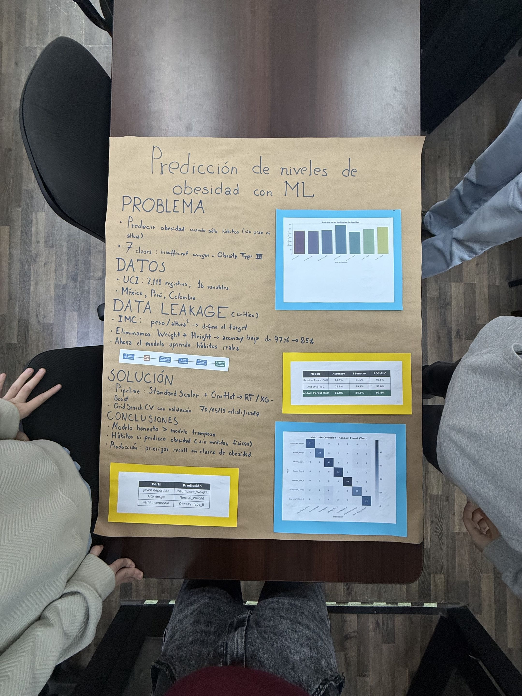

# Proyecto Semestral: Prediccion de Niveles de Obesidad

**Curso:** Ingenieria de Datos 2026  
**Dataset:** [Estimation of Obesity Levels Based On Eating Habits and Physical Condition (UCI)](https://archive.ics.uci.edu/dataset/544/estimation+of+obesity+levels+based+on+eating+habits+and+physical+condition)

## Poster del Proyecto



## Descripcion

Clasificacion multiclase para predecir 7 niveles de obesidad a partir de habitos alimenticios y actividad fisica. Se excluyen **Weight** y **Height** del entrenamiento para evitar *data leakage* (el IMC se define con esas variables).

## Modelos

- Random Forest
- XGBoost

## Requisitos

```bash
python3 -m venv venv_obesidad
source venv_obesidad/bin/activate
pip install pandas numpy seaborn matplotlib scikit-learn xgboost mlxtend ucimlrepo jupyter
```

## Ejecutar

```bash
jupyter notebook Proyecto_Semestral_Datos.ipynb
```

Tambien se puede ejecutar directamente en [Google Colab](https://colab.research.google.com/) subiendo el `.ipynb`.

## Archivos

| Archivo | Descripcion |
|---|---|
| `Proyecto_Semestral_Datos.ipynb` | Notebook principal con todo el flujo |
| `.gitignore` | Ignora venv, CSV, checkpoints y artifacts |
